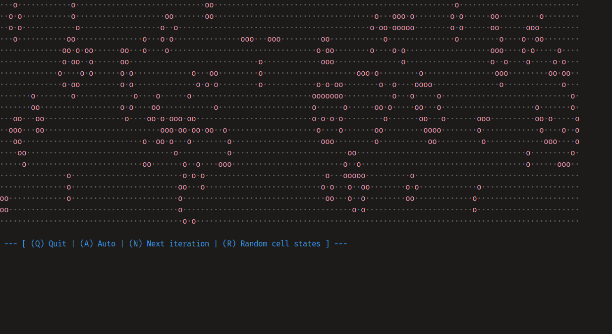

# fell



Cellular automaton in haskell with rules for the game of life.

## Installation & Run

```fish
$ git clone https://github.com/karlek/fell.git
$ cd fell
$ stack build
$ stack exec fell
```
